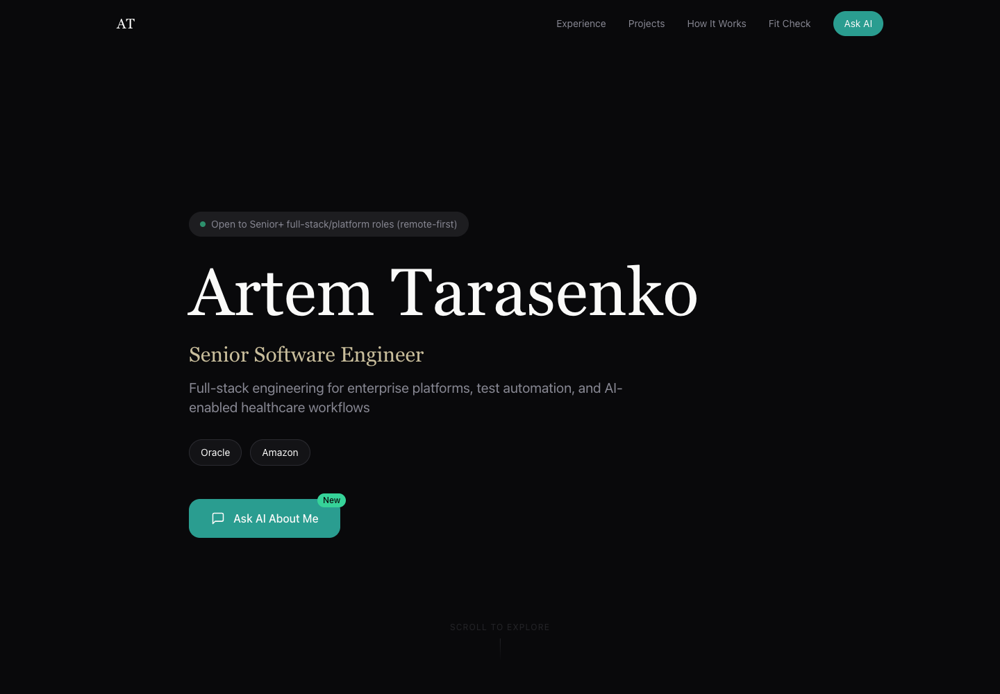
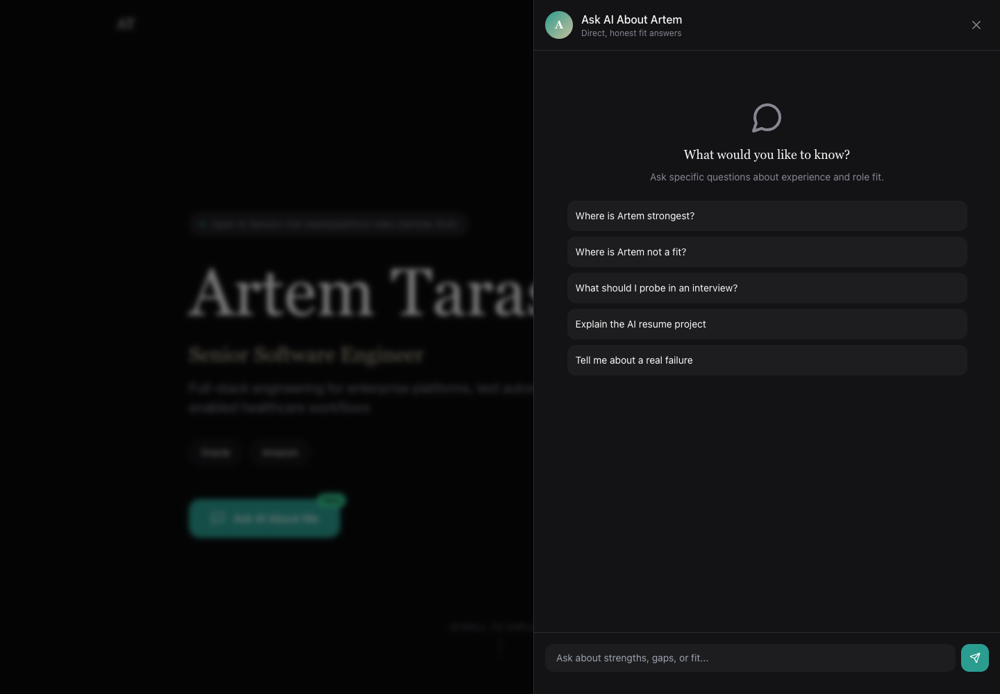
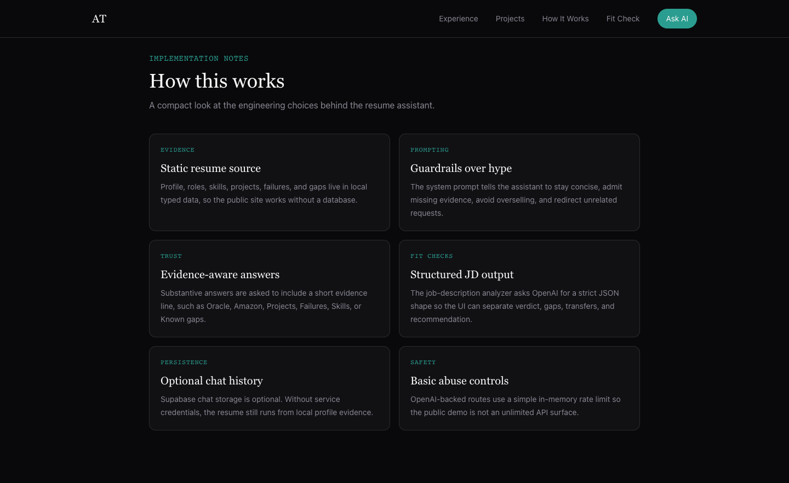
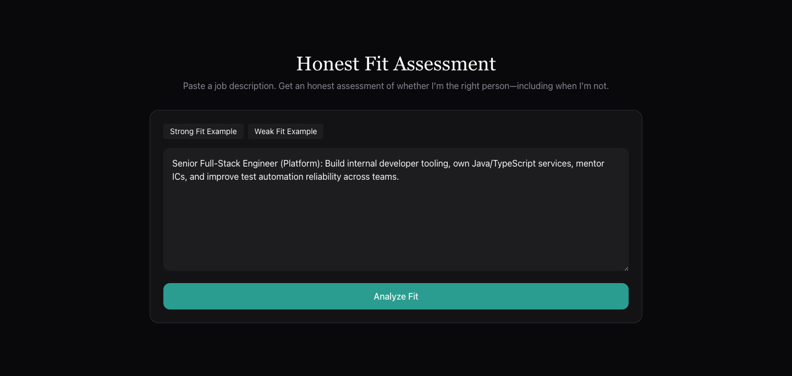

# Artem AI Resume

An AI-queryable resume and candidate portfolio built with Next.js and the OpenAI Responses API.

The project is intentionally opinionated: the assistant is designed to answer recruiter-style questions with evidence, admit gaps, and recommend against a fit when the role does not match my background.

## What It Does

- Presents my career narrative, experience, strengths, and known gaps as a polished portfolio.
- Lets visitors ask an AI assistant specific questions about my background.
- Analyzes a pasted job description and returns a structured, honest fit assessment.
- Explains the implementation choices behind the assistant in a compact case-study section.
- Uses a local static profile as the source of truth, so the public site works without a database.
- Optionally stores chat turns in Supabase when Supabase service credentials are configured.

## Screenshots

Portfolio overview:



Resume chat drawer:



How it works:



Job-description fit analyzer:



## Stack

- Next.js App Router
- React and TypeScript
- Tailwind CSS
- OpenAI Responses API
- Zod for request and response validation
- Supabase optional chat-history persistence
- Vitest for prompt and schema tests

## Project Shape

```txt
src/app
  api/chat        AI resume chat endpoint
  api/analyze-jd  structured job-fit analyzer
  page.tsx        public portfolio entrypoint

src/components    portfolio UI and chat drawer
src/data          approved resume/profile context
src/lib/ai        prompt builders
src/types         shared domain types
supabase          optional chat-history schema
```

## AI Behavior

The system prompt is built in `src/lib/ai/build-system-prompt.ts`. Core rules:

- Never oversell.
- Be direct about missing requirements.
- Use first person.
- Keep answers concise and concrete.
- It is acceptable to say: "I'm probably not your person for this role."

The job-description analyzer uses Structured Outputs so the UI receives a predictable schema for verdict, gaps, transferable strengths, and recommendation.

## Local Setup

```sh
npm install
cp .env.example .env.local
npm run dev
```

Open `http://localhost:3000`.

The app runs without API keys, but chat and JD analysis use fallback/mock responses. Add `OPENAI_API_KEY` for real AI responses.

## Environment Variables

```sh
OPENAI_API_KEY=
OPENAI_MODEL_CHAT=gpt-4.1-mini
OPENAI_MODEL_ANALYZE=gpt-4.1-mini
NEXT_PUBLIC_SITE_URL=https://v0-artem-ai-resume.vercel.app

# Optional: only needed for persisted chat history
NEXT_PUBLIC_SUPABASE_URL=
SUPABASE_SERVICE_ROLE_KEY=
```

## Useful Commands

```sh
npm run dev
npm run test
npm run lint
npm run build
```

## Notes

This is not a generic resume builder. It is a single-candidate portfolio built to demonstrate product judgment, full-stack implementation, and practical AI behavior for a real hiring workflow.
